# {.tabset .tabset-pills}

## Summary plots

### Bar plots for lipid classes
These plots show log2 transformed mean values for each condition 
within each lipid subclass. The errorbars show the standard error of the mean.  
More information can be found in the other tabs in the report.
  


#### <a href="#pc">PC</a>, <a href="#sm">SM</a>


### PC

#### High abundance  

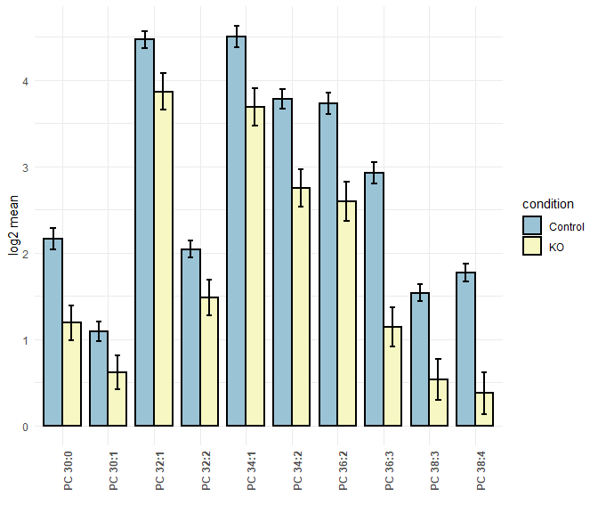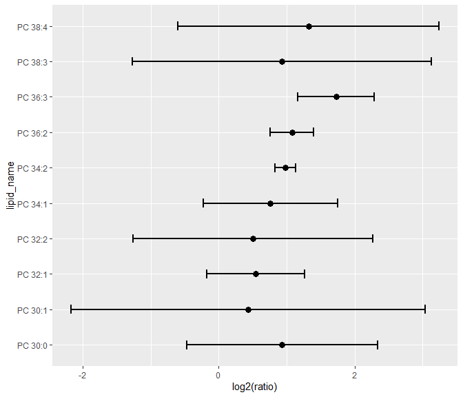

#### Low abundance log transformed

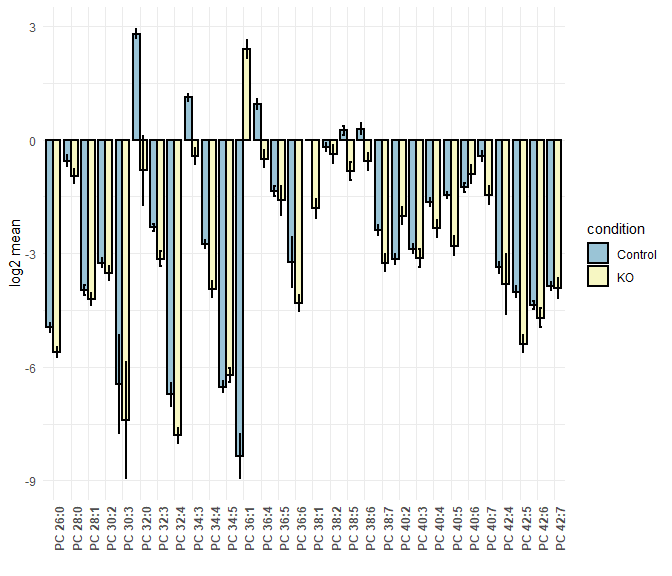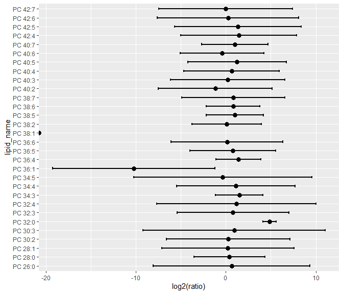
<br>  

#### Low abundance linear

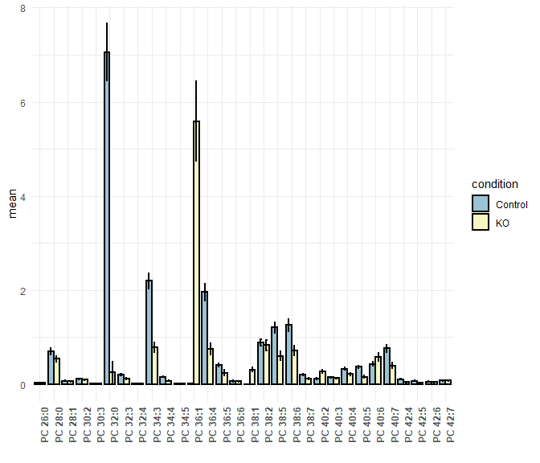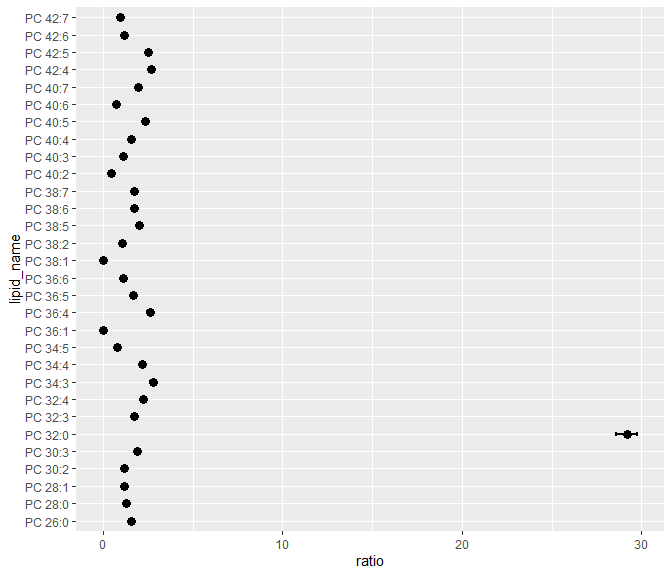

  
<br>
<br>


### SM

#### High abundance  

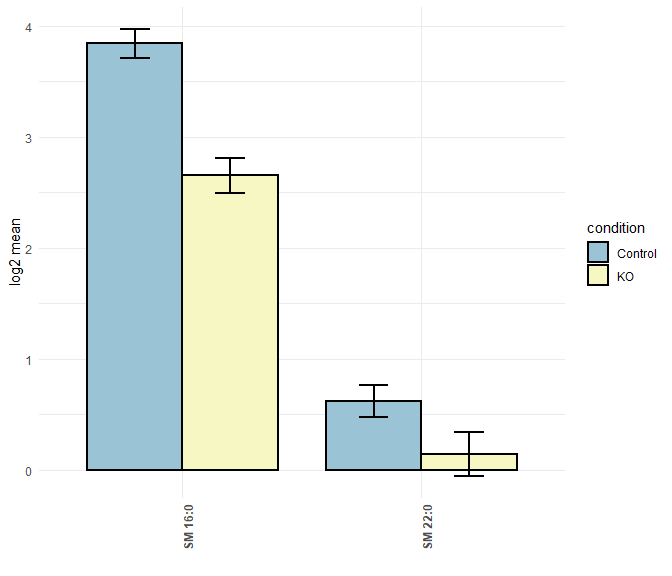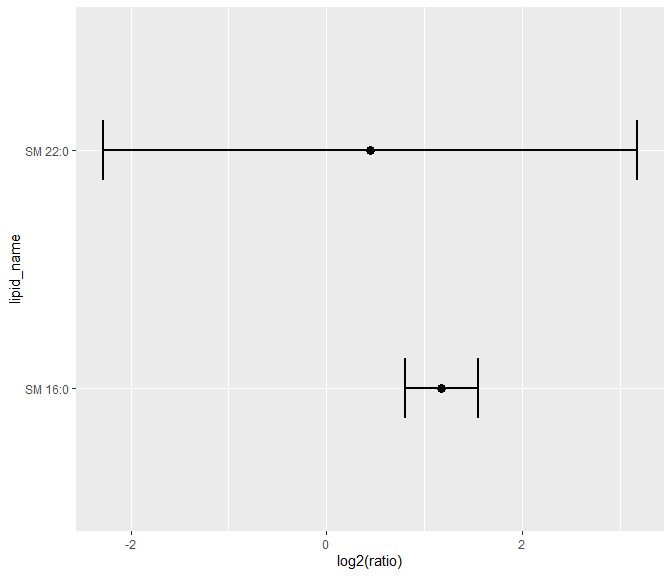

#### Low abundance log transformed

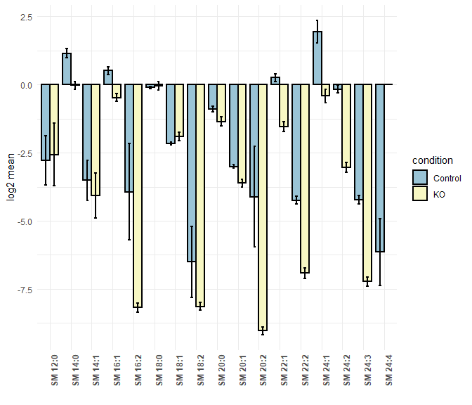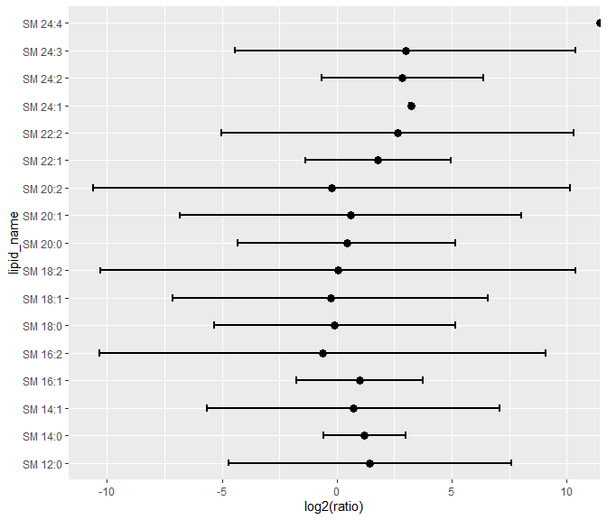
<br>  

#### Low abundance linear

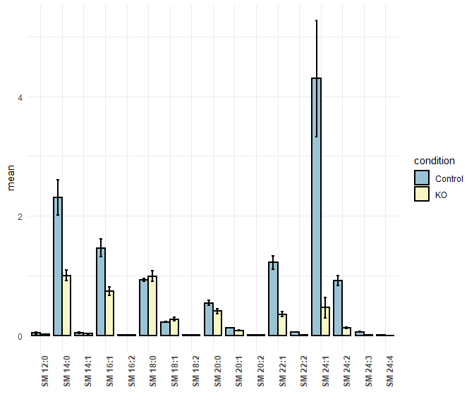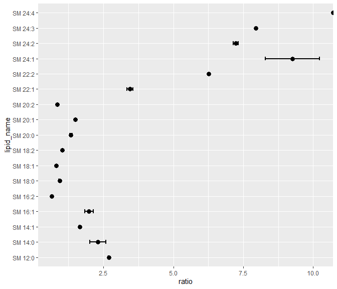

  
<br>
<br>


## Summary table


```{=html}
<div id="htmlwidget-f727e1f814139a7c752f" style="width:100%;height:auto;" class="datatables html-widget"></div>
<script type="application/json" data-for="htmlwidget-f727e1f814139a7c752f">{"x":{"filter":"none","data":[["PC","PC","PC","PC","PC","PC","PC","PC","PC","PC","PC","PC","PC","PC","PC","PC","PC","PC","PC","PC","PC","PC","PC","PC","PC","PC","PC","PC","PC","PC","PC","PC","PC","PC","PC","PC","PC","PC","PC","PC","SM","SM","SM","SM","SM","SM","SM","SM","SM","SM","SM","SM","SM","SM","SM","SM","SM","SM","SM"],["PC 26:0","PC 28:0","PC 28:1","PC 30:0","PC 30:1","PC 30:2","PC 30:3","PC 32:0","PC 32:1","PC 32:2","PC 32:3","PC 32:4","PC 34:1","PC 34:2","PC 34:3","PC 34:4","PC 34:5","PC 36:1","PC 36:2","PC 36:3","PC 36:4","PC 36:5","PC 36:6","PC 38:1","PC 38:2","PC 38:3","PC 38:4","PC 38:5","PC 38:6","PC 38:7","PC 40:2","PC 40:3","PC 40:4","PC 40:5","PC 40:6","PC 40:7","PC 42:4","PC 42:5","PC 42:6","PC 42:7","SM 12:0","SM 14:0","SM 14:1","SM 16:0","SM 16:1","SM 16:2","SM 18:0","SM 18:1","SM 18:2","SM 20:0","SM 20:1","SM 20:2","SM 22:0","SM 22:1","SM 22:2","SM 24:1","SM 24:2","SM 24:3","SM 24:4"],[1.56661418946432,1.30886161263558,1.1636849733785,1.906032006311,1.34921218374962,1.1888421393446,1.91972834520159,29.1738088087115,1.46090716574859,1.41845024418933,1.71068620236333,2.25658215145631,1.69138388473183,1.9671682608037,2.81222480605414,2.17175951351653,0.793445991971885,0.000824466699322852,2.10943274354574,3.30889597327302,2.61889208289787,1.70562744231287,1.09888266802193,0,1.08114627608598,1.90245347502049,2.50227768014976,2.01515839541275,1.75011736159504,1.76042981995238,0.44112973654562,1.14745204866361,1.56190254449419,2.36758350551488,0.746294544390969,1.96406741416467,2.70130991032803,2.52451689763257,1.19328447490795,0.984898298707377,2.6970434285166,2.30034429286976,1.65261478170888,2.26232128633167,1.98555535543803,0.649227644328236,0.937698263990613,0.819289691587433,1.03596654939693,1.341723580825,1.50242376137323,0.85422133548151,1.36454783611684,3.45072788140103,6.26258660265992,9.26134956980175,7.22938626496038,7.95420579126584,null],[0.00987,0.0793,0.277,0.00217,0.0388,0.191,0.247,null,0.0217,0.033,0.00477,0.0429,0.00671,0.00202,0.000375,0.0011,0.2,3.25e-05,0.00253,0.000399,0.00346,0.0171,0.632,null,0.563,0.00191,0.000445,0.00224,0.00865,0.00637,0.0039,0.398,0.0152,0.000622,0.186,0.004,0.0242,0.00342,0.359,0.914,null,0.00492,0.238,0.00223,0.00503,null,0.71,0.18,0.254,0.0647,0.0103,null,0.0861,0.000513,8.9e-05,null,5.41e-05,4.28e-05,null],["linear_paired_t_test","linear_paired_t_test","linear_paired_t_test","linear_paired_t_test","linear_paired_t_test","linear_paired_t_test","linear_paired_t_test","none","linear_paired_t_test","linear_paired_t_test","linear_paired_t_test","log2_paired_t_test","linear_paired_t_test","linear_paired_t_test","linear_paired_t_test","linear_paired_t_test","linear_paired_t_test","log2_paired_t_test","linear_paired_t_test","linear_paired_t_test","linear_paired_t_test","linear_paired_t_test","linear_paired_t_test","none","linear_paired_t_test","linear_paired_t_test","linear_paired_t_test","linear_paired_t_test","linear_paired_t_test","linear_paired_t_test","log2_paired_t_test","linear_paired_t_test","linear_paired_t_test","linear_paired_t_test","log2_paired_t_test","linear_paired_t_test","linear_paired_t_test","log2_paired_t_test","linear_paired_t_test","linear_paired_t_test","none","log2_paired_t_test","linear_paired_t_test","linear_paired_t_test","log2_paired_t_test","none","log2_paired_t_test","log2_paired_t_test","log2_paired_t_test","linear_paired_t_test","linear_paired_t_test","none","linear_paired_t_test","log2_paired_t_test","log2_paired_t_test","none","log2_paired_t_test","log2_paired_t_test","none"],[0.0325293582319777,0.696825378804586,0.0651987119953057,4.54813117612846,2.16470504409286,0.106630387909768,0.00399963462665707,7.05869269170417,22.3955167398023,4.1571440346405,0.20222061050736,0.0105622033533883,23.0397931360638,13.9284087565575,2.18992743870795,0.149313852809748,0.0111265917219361,0.00460835285008172,13.5316755091192,7.73662056394019,1.95630647859312,0.397544428727711,0.0584083764877521,0,0.888143161259371,2.93449447855042,3.46513975075854,1.20415854893736,1.24946083632855,0.195933776297956,0.115479687155227,0.138549011869163,0.323692842972916,0.364629372554206,0.4259561667435,0.760382755460895,0.0990658251187855,0.0633876534577631,0.0490563518456637,0.0696904311312442,0.0388045747176791,2.30693203269909,0.0470427503412185,14.617891166226,1.4622073372376,0.00229615372109705,0.930943672410802,0.223396716651913,0.00375865587323619,0.542494406806071,0.125507215820264,0.00166283567426157,1.57126173906687,1.22012129646781,0.0539764579784195,4.29788927199569,0.916335562138711,0.0550977958559093,0.00509645411519396],[0.0207641156646874,0.532390416280473,0.0560278026156992,2.38617775623352,1.60442150624292,0.0896926382240723,0.00208343781382103,0.241953072976759,15.3298698677588,2.93076479183547,0.118210230624407,0.00468061991298294,13.621859203014,7.08043589055615,0.778717062019183,0.068752480134404,0.0140231242384679,5.58949543246154,6.41484093319507,2.33812746802295,0.746997744339439,0.233078114754434,0.0531525140831384,0.304260599641333,0.821482884327798,1.54247897101337,1.38479425295084,0.597550322435433,0.713929741940169,0.111298828318675,0.261781688216079,0.120744925272063,0.207242663195571,0.154009086355292,0.570761464015673,0.387146973661437,0.0366732542386281,0.025108825184417,0.0411103579047634,0.0707590126033408,0.0143878197538042,1.00286380601797,0.0284656478096935,6.46145675883584,0.736422348152075,0.0035367466884022,0.99279662569592,0.272671216232522,0.00362816335664914,0.404326505518,0.0835364955261019,0.00194660985998934,1.1514889382979,0.353583747662081,0.00861887609753676,0.464067276545711,0.126751501241542,0.00692687583170273,0],[0.647649930621728,0.388312567627958,0.218700552355099,0.93057234535408,0.432117251452511,0.249557159234458,0.940902174093029,4.86660184556382,0.546864504103477,0.504315545240204,0.774575145091335,1.1741393011922,0.758204138011829,0.976120363129953,1.49171192642182,1.1188643573477,-0.333796069389713,-10.2442511559801,1.07685508988016,1.72634993619496,1.38895661154959,0.770302555317014,0.136037352347545,null,0.112561728907159,0.927861172689167,1.32324189563733,1.01089324187748,0.807451671379824,0.815927714889317,-1.18072507913894,0.198433865533918,0.643304438780024,1.24341531095981,-0.422182955204676,0.9738444492106,1.4336591638917,1.33600733397413,0.254938017563607,-0.0219533363342548,1.43137875242302,1.20184980570994,0.724750477028815,1.17780382998304,0.989542582420019,-0.623203663260656,-0.0928043332077006,-0.287554432130931,0.0509774202075957,0.424087481039614,0.587291785026747,-0.227318162946912,0.448422971174056,1.78690070975369,2.64675864886499,3.21122243925151,2.85387317551924,2.9917178880418,null]],"container":"<table class=\"display\">\n  <thead>\n    <tr>\n      <th>class<\/th>\n      <th>lipid_name<\/th>\n      <th>fold_change<\/th>\n      <th>p_val<\/th>\n      <th>test_type<\/th>\n      <th>mean_Control<\/th>\n      <th>mean_KO<\/th>\n      <th>log2_fc<\/th>\n    <\/tr>\n  <\/thead>\n<\/table>","options":{"pageLength":15,"dom":"ftlip","columnDefs":[{"targets":2,"render":"function(data, type, row, meta) {\n    return type !== 'display' ? data : DTWidget.formatRound(data, 2, 3, \",\", \".\");\n  }"},{"targets":5,"render":"function(data, type, row, meta) {\n    return type !== 'display' ? data : DTWidget.formatRound(data, 2, 3, \",\", \".\");\n  }"},{"targets":6,"render":"function(data, type, row, meta) {\n    return type !== 'display' ? data : DTWidget.formatRound(data, 2, 3, \",\", \".\");\n  }"},{"targets":7,"render":"function(data, type, row, meta) {\n    return type !== 'display' ? data : DTWidget.formatRound(data, 2, 3, \",\", \".\");\n  }"},{"className":"dt-right","targets":[2,3,5,6,7]}],"order":[],"autoWidth":false,"orderClasses":false,"lengthMenu":[10,15,25,50,100]}},"evals":["options.columnDefs.0.render","options.columnDefs.1.render","options.columnDefs.2.render","options.columnDefs.3.render"],"jsHooks":[]}</script>
```

## Metadata

<div class = "col-md-6">

```{=html}
<div id="htmlwidget-a4bdea169296a7533f31" style="width:100%;height:auto;" class="datatables html-widget"></div>
<script type="application/json" data-for="htmlwidget-a4bdea169296a7533f31">{"x":{"filter":"none","data":[["S1_1","S1_2","S1_3","S1_4","S1_5","S1_6","S2_1","S2_2","S2_3","S2_4","S2_5","S2_6"],["Control","Control","Control","Control","Control","Control","KO","KO","KO","KO","KO","KO"]],"container":"<table class=\"display\">\n  <thead>\n    <tr>\n      <th>sample_name<\/th>\n      <th>condition<\/th>\n    <\/tr>\n  <\/thead>\n<\/table>","options":{"pageLength":15,"dom":"tp","order":[],"autoWidth":false,"orderClasses":false,"lengthMenu":[10,15,25,50,100]}},"evals":[],"jsHooks":[]}</script>
```
</div>


## Individual lipids

#### Scroll down to browse plots for individual lipids or click on the name in the table below to navigate directly to the plot.


```{=html}
<div id="htmlwidget-7de70d83e8612c2c26e9" style="width:100%;height:auto;" class="datatables html-widget"></div>
<script type="application/json" data-for="htmlwidget-7de70d83e8612c2c26e9">{"x":{"filter":"top","filterHTML":"<tr>\n  <td data-type=\"character\" style=\"vertical-align: top;\">\n    <div class=\"form-group has-feedback\" style=\"margin-bottom: auto;\">\n      <input type=\"search\" placeholder=\"All\" class=\"form-control\" style=\"width: 100%;\"/>\n      <span class=\"glyphicon glyphicon-remove-circle form-control-feedback\"><\/span>\n    <\/div>\n  <\/td>\n  <td data-type=\"character\" style=\"vertical-align: top;\">\n    <div class=\"form-group has-feedback\" style=\"margin-bottom: auto;\">\n      <input type=\"search\" placeholder=\"All\" class=\"form-control\" style=\"width: 100%;\"/>\n      <span class=\"glyphicon glyphicon-remove-circle form-control-feedback\"><\/span>\n    <\/div>\n  <\/td>\n  <td data-type=\"number\" style=\"vertical-align: top;\">\n    <div class=\"form-group has-feedback\" style=\"margin-bottom: auto;\">\n      <input type=\"search\" placeholder=\"All\" class=\"form-control\" style=\"width: 100%;\"/>\n      <span class=\"glyphicon glyphicon-remove-circle form-control-feedback\"><\/span>\n    <\/div>\n    <div style=\"display: none; position: absolute; width: 200px;\">\n      <div data-min=\"3.24e-05\" data-max=\"0.914\" data-scale=\"7\"><\/div>\n      <span style=\"float: left;\"><\/span>\n      <span style=\"float: right;\"><\/span>\n    <\/div>\n  <\/td>\n  <td data-type=\"character\" style=\"vertical-align: top;\">\n    <div class=\"form-group has-feedback\" style=\"margin-bottom: auto;\">\n      <input type=\"search\" placeholder=\"All\" class=\"form-control\" style=\"width: 100%;\"/>\n      <span class=\"glyphicon glyphicon-remove-circle form-control-feedback\"><\/span>\n    <\/div>\n  <\/td>\n  <td data-type=\"number\" style=\"vertical-align: top;\">\n    <div class=\"form-group has-feedback\" style=\"margin-bottom: auto;\">\n      <input type=\"search\" placeholder=\"All\" class=\"form-control\" style=\"width: 100%;\"/>\n      <span class=\"glyphicon glyphicon-remove-circle form-control-feedback\"><\/span>\n    <\/div>\n    <div style=\"display: none; position: absolute; width: 200px;\">\n      <div data-min=\"0\" data-max=\"23.0397931360638\" data-scale=\"15\"><\/div>\n      <span style=\"float: left;\"><\/span>\n      <span style=\"float: right;\"><\/span>\n    <\/div>\n  <\/td>\n  <td data-type=\"number\" style=\"vertical-align: top;\">\n    <div class=\"form-group has-feedback\" style=\"margin-bottom: auto;\">\n      <input type=\"search\" placeholder=\"All\" class=\"form-control\" style=\"width: 100%;\"/>\n      <span class=\"glyphicon glyphicon-remove-circle form-control-feedback\"><\/span>\n    <\/div>\n    <div style=\"display: none; position: absolute; width: 200px;\">\n      <div data-min=\"0\" data-max=\"15.3298698677588\" data-scale=\"15\"><\/div>\n      <span style=\"float: left;\"><\/span>\n      <span style=\"float: right;\"><\/span>\n    <\/div>\n  <\/td>\n  <td data-type=\"disabled\" style=\"vertical-align: top;\">\n    <div class=\"form-group has-feedback\" style=\"margin-bottom: auto;\">\n      <input type=\"search\" placeholder=\"All\" class=\"form-control\" style=\"width: 100%;\"/>\n      <span class=\"glyphicon glyphicon-remove-circle form-control-feedback\"><\/span>\n    <\/div>\n  <\/td>\n<\/tr>","data":[["PC","PC","PC","PC","PC","PC","PC","PC","PC","PC","PC","PC","PC","PC","PC","PC","PC","PC","PC","PC","PC","PC","PC","PC","PC","PC","PC","PC","PC","PC","PC","PC","PC","PC","PC","PC","PC","PC","PC","PC","SM","SM","SM","SM","SM","SM","SM","SM","SM","SM","SM","SM","SM","SM","SM","SM","SM","SM","SM"],["<a href=\"#pc-260\">PC 26:0<\/a>","<a href=\"#pc-280\">PC 28:0<\/a>","<a href=\"#pc-281\">PC 28:1<\/a>","<a href=\"#pc-300\">PC 30:0<\/a>","<a href=\"#pc-301\">PC 30:1<\/a>","<a href=\"#pc-302\">PC 30:2<\/a>","<a href=\"#pc-303\">PC 30:3<\/a>","<a href=\"#pc-320\">PC 32:0<\/a>","<a href=\"#pc-321\">PC 32:1<\/a>","<a href=\"#pc-322\">PC 32:2<\/a>","<a href=\"#pc-323\">PC 32:3<\/a>","<a href=\"#pc-324\">PC 32:4<\/a>","<a href=\"#pc-341\">PC 34:1<\/a>","<a href=\"#pc-342\">PC 34:2<\/a>","<a href=\"#pc-343\">PC 34:3<\/a>","<a href=\"#pc-344\">PC 34:4<\/a>","<a href=\"#pc-345\">PC 34:5<\/a>","<a href=\"#pc-361\">PC 36:1<\/a>","<a href=\"#pc-362\">PC 36:2<\/a>","<a href=\"#pc-363\">PC 36:3<\/a>","<a href=\"#pc-364\">PC 36:4<\/a>","<a href=\"#pc-365\">PC 36:5<\/a>","<a href=\"#pc-366\">PC 36:6<\/a>","<a href=\"#pc-381\">PC 38:1<\/a>","<a href=\"#pc-382\">PC 38:2<\/a>","<a href=\"#pc-383\">PC 38:3<\/a>","<a href=\"#pc-384\">PC 38:4<\/a>","<a href=\"#pc-385\">PC 38:5<\/a>","<a href=\"#pc-386\">PC 38:6<\/a>","<a href=\"#pc-387\">PC 38:7<\/a>","<a href=\"#pc-402\">PC 40:2<\/a>","<a href=\"#pc-403\">PC 40:3<\/a>","<a href=\"#pc-404\">PC 40:4<\/a>","<a href=\"#pc-405\">PC 40:5<\/a>","<a href=\"#pc-406\">PC 40:6<\/a>","<a href=\"#pc-407\">PC 40:7<\/a>","<a href=\"#pc-424\">PC 42:4<\/a>","<a href=\"#pc-425\">PC 42:5<\/a>","<a href=\"#pc-426\">PC 42:6<\/a>","<a href=\"#pc-427\">PC 42:7<\/a>","<a href=\"#sm-120\">SM 12:0<\/a>","<a href=\"#sm-140\">SM 14:0<\/a>","<a href=\"#sm-141\">SM 14:1<\/a>","<a href=\"#sm-160\">SM 16:0<\/a>","<a href=\"#sm-161\">SM 16:1<\/a>","<a href=\"#sm-162\">SM 16:2<\/a>","<a href=\"#sm-180\">SM 18:0<\/a>","<a href=\"#sm-181\">SM 18:1<\/a>","<a href=\"#sm-182\">SM 18:2<\/a>","<a href=\"#sm-200\">SM 20:0<\/a>","<a href=\"#sm-201\">SM 20:1<\/a>","<a href=\"#sm-202\">SM 20:2<\/a>","<a href=\"#sm-220\">SM 22:0<\/a>","<a href=\"#sm-221\">SM 22:1<\/a>","<a href=\"#sm-222\">SM 22:2<\/a>","<a href=\"#sm-241\">SM 24:1<\/a>","<a href=\"#sm-242\">SM 24:2<\/a>","<a href=\"#sm-243\">SM 24:3<\/a>","<a href=\"#sm-244\">SM 24:4<\/a>"],[0.00987,0.0793,0.277,0.00217,0.0388,0.191,0.247,null,0.0217,0.033,0.00477,0.0429,0.00671,0.00202,0.000375,0.0011,0.2,3.25e-05,0.00253,0.000399,0.00346,0.0171,0.632,null,0.563,0.00191,0.000445,0.00224,0.00865,0.00637,0.0039,0.398,0.0152,0.000622,0.186,0.004,0.0242,0.00342,0.359,0.914,null,0.00492,0.238,0.00223,0.00503,null,0.71,0.18,0.254,0.0647,0.0103,null,0.0861,0.000513,8.9e-05,null,5.41e-05,4.28e-05,null],["linear_paired_t_test","linear_paired_t_test","linear_paired_t_test","linear_paired_t_test","linear_paired_t_test","linear_paired_t_test","linear_paired_t_test","none","linear_paired_t_test","linear_paired_t_test","linear_paired_t_test","log2_paired_t_test","linear_paired_t_test","linear_paired_t_test","linear_paired_t_test","linear_paired_t_test","linear_paired_t_test","log2_paired_t_test","linear_paired_t_test","linear_paired_t_test","linear_paired_t_test","linear_paired_t_test","linear_paired_t_test","none","linear_paired_t_test","linear_paired_t_test","linear_paired_t_test","linear_paired_t_test","linear_paired_t_test","linear_paired_t_test","log2_paired_t_test","linear_paired_t_test","linear_paired_t_test","linear_paired_t_test","log2_paired_t_test","linear_paired_t_test","linear_paired_t_test","log2_paired_t_test","linear_paired_t_test","linear_paired_t_test","none","log2_paired_t_test","linear_paired_t_test","linear_paired_t_test","log2_paired_t_test","none","log2_paired_t_test","log2_paired_t_test","log2_paired_t_test","linear_paired_t_test","linear_paired_t_test","none","linear_paired_t_test","log2_paired_t_test","log2_paired_t_test","none","log2_paired_t_test","log2_paired_t_test","none"],[0.0325293582319777,0.696825378804586,0.0651987119953057,4.54813117612846,2.16470504409286,0.106630387909768,0.00399963462665707,7.05869269170417,22.3955167398023,4.1571440346405,0.20222061050736,0.0105622033533883,23.0397931360638,13.9284087565575,2.18992743870795,0.149313852809748,0.0111265917219361,0.00460835285008172,13.5316755091192,7.73662056394019,1.95630647859312,0.397544428727711,0.0584083764877521,0,0.888143161259371,2.93449447855042,3.46513975075854,1.20415854893736,1.24946083632855,0.195933776297956,0.115479687155227,0.138549011869163,0.323692842972916,0.364629372554206,0.4259561667435,0.760382755460895,0.0990658251187855,0.0633876534577631,0.0490563518456637,0.0696904311312442,0.0388045747176791,2.30693203269909,0.0470427503412185,14.617891166226,1.4622073372376,0.00229615372109705,0.930943672410802,0.223396716651913,0.00375865587323619,0.542494406806071,0.125507215820264,0.00166283567426157,1.57126173906687,1.22012129646781,0.0539764579784195,4.29788927199569,0.916335562138711,0.0550977958559093,0.00509645411519396],[0.0207641156646874,0.532390416280473,0.0560278026156992,2.38617775623352,1.60442150624292,0.0896926382240723,0.00208343781382103,0.241953072976759,15.3298698677588,2.93076479183547,0.118210230624407,0.00468061991298294,13.621859203014,7.08043589055615,0.778717062019183,0.068752480134404,0.0140231242384679,5.58949543246154,6.41484093319507,2.33812746802295,0.746997744339439,0.233078114754434,0.0531525140831384,0.304260599641333,0.821482884327798,1.54247897101337,1.38479425295084,0.597550322435433,0.713929741940169,0.111298828318675,0.261781688216079,0.120744925272063,0.207242663195571,0.154009086355292,0.570761464015673,0.387146973661437,0.0366732542386281,0.025108825184417,0.0411103579047634,0.0707590126033408,0.0143878197538042,1.00286380601797,0.0284656478096935,6.46145675883584,0.736422348152075,0.0035367466884022,0.99279662569592,0.272671216232522,0.00362816335664914,0.404326505518,0.0835364955261019,0.00194660985998934,1.1514889382979,0.353583747662081,0.00861887609753676,0.464067276545711,0.126751501241542,0.00692687583170273,0],[0.647649930621728,0.388312567627958,0.218700552355099,0.93057234535408,0.432117251452511,0.249557159234458,0.940902174093029,4.86660184556382,0.546864504103477,0.504315545240204,0.774575145091335,1.1741393011922,0.758204138011829,0.976120363129953,1.49171192642182,1.1188643573477,-0.333796069389713,-10.2442511559801,1.07685508988016,1.72634993619496,1.38895661154959,0.770302555317014,0.136037352347545,null,0.112561728907159,0.927861172689167,1.32324189563733,1.01089324187748,0.807451671379824,0.815927714889317,-1.18072507913894,0.198433865533918,0.643304438780024,1.24341531095981,-0.422182955204676,0.9738444492106,1.4336591638917,1.33600733397413,0.254938017563607,-0.0219533363342548,1.43137875242302,1.20184980570994,0.724750477028815,1.17780382998304,0.989542582420019,-0.623203663260656,-0.0928043332077006,-0.287554432130931,0.0509774202075957,0.424087481039614,0.587291785026747,-0.227318162946912,0.448422971174056,1.78690070975369,2.64675864886499,3.21122243925151,2.85387317551924,2.9917178880418,null]],"container":"<table class=\"display\">\n  <thead>\n    <tr>\n      <th>class<\/th>\n      <th>lipid_name<\/th>\n      <th>p_val<\/th>\n      <th>test_type<\/th>\n      <th>mean_Control<\/th>\n      <th>mean_KO<\/th>\n      <th>log2_fc<\/th>\n    <\/tr>\n  <\/thead>\n<\/table>","options":{"pageLength":5,"dom":"tlip","columnDefs":[{"targets":4,"render":"function(data, type, row, meta) {\n    return type !== 'display' ? data : DTWidget.formatRound(data, 3, 3, \",\", \".\");\n  }"},{"targets":5,"render":"function(data, type, row, meta) {\n    return type !== 'display' ? data : DTWidget.formatRound(data, 3, 3, \",\", \".\");\n  }"},{"targets":6,"render":"function(data, type, row, meta) {\n    return type !== 'display' ? data : DTWidget.formatRound(data, 3, 3, \",\", \".\");\n  }"},{"className":"dt-right","targets":[2,4,5,6]}],"order":[],"autoWidth":false,"orderClasses":false,"orderCellsTop":true,"lengthMenu":[5,10,25,50,100]}},"evals":["options.columnDefs.0.render","options.columnDefs.1.render","options.columnDefs.2.render"],"jsHooks":[]}</script>
```


### PC 26:0


<div class = "row">
<div class = "col-md-6">
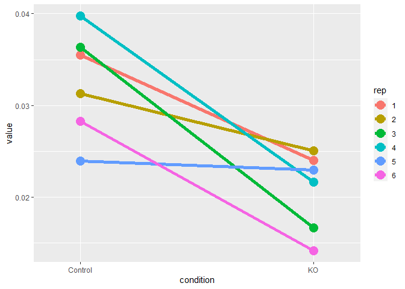<!-- -->
</div>
<div class = "col-md-6">
<br>
<br>  

#### Test performed: linear_paired_t_test  

#### p-value (uncorrected)    
0.00987
<br>

Paired t-test performed on linear data. 
 The ratio of standard deviations between the conditions was small enough that the data did not need to be log transformed. 
 The samples were paired.

</div>
</div>


### PC 28:0


<div class = "row">
<div class = "col-md-6">
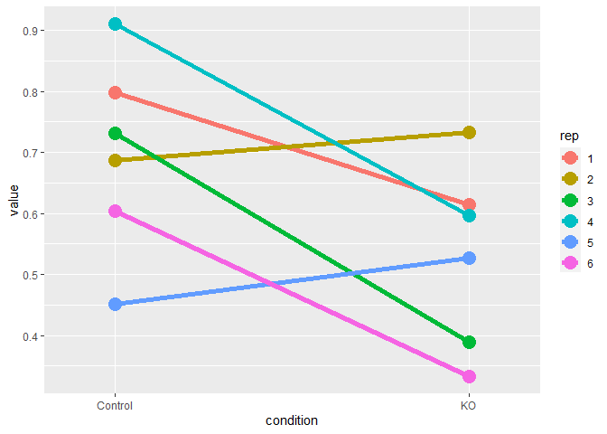<!-- -->
</div>
<div class = "col-md-6">
<br>
<br>  

#### Test performed: linear_paired_t_test  

#### p-value (uncorrected)    
0.0793
<br>

Paired t-test performed on linear data. 
 The ratio of standard deviations between the conditions was small enough that the data did not need to be log transformed. 
 The samples were paired.

</div>
</div>


### PC 28:1


<div class = "row">
<div class = "col-md-6">
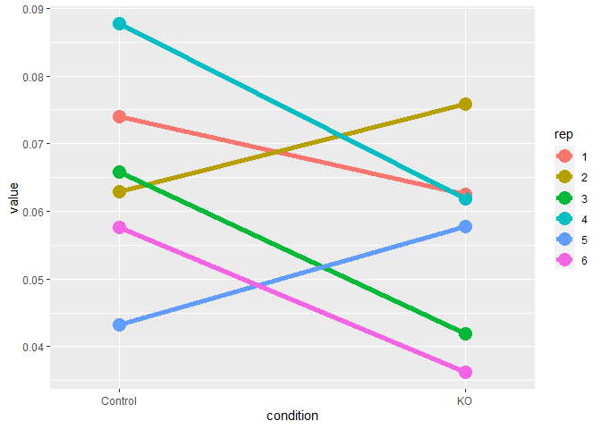<!-- -->
</div>
<div class = "col-md-6">
<br>
<br>  

#### Test performed: linear_paired_t_test  

#### p-value (uncorrected)    
0.277
<br>

Paired t-test performed on linear data. 
 The ratio of standard deviations between the conditions was small enough that the data did not need to be log transformed. 
 The samples were paired.

</div>
</div>


### PC 30:0


<div class = "row">
<div class = "col-md-6">
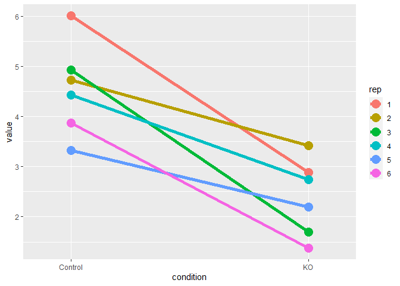<!-- -->
</div>
<div class = "col-md-6">
<br>
<br>  

#### Test performed: linear_paired_t_test  

#### p-value (uncorrected)    
0.00217
<br>

Paired t-test performed on linear data. 
 The ratio of standard deviations between the conditions was small enough that the data did not need to be log transformed. 
 The samples were paired.

</div>
</div>


### PC 30:1


<div class = "row">
<div class = "col-md-6">
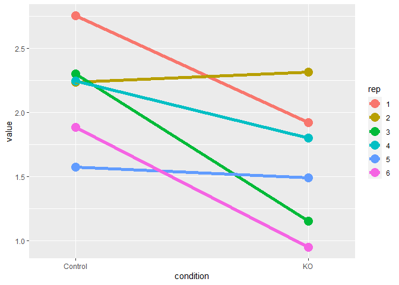<!-- -->
</div>
<div class = "col-md-6">
<br>
<br>  

#### Test performed: linear_paired_t_test  

#### p-value (uncorrected)    
0.0388
<br>

Paired t-test performed on linear data. 
 The ratio of standard deviations between the conditions was small enough that the data did not need to be log transformed. 
 The samples were paired.

</div>
</div>


### PC 30:2


<div class = "row">
<div class = "col-md-6">
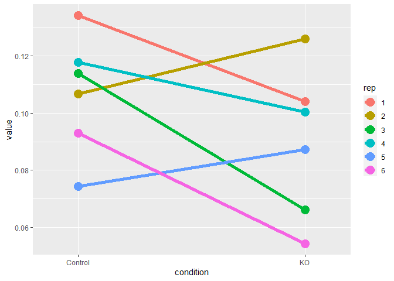<!-- -->
</div>
<div class = "col-md-6">
<br>
<br>  

#### Test performed: linear_paired_t_test  

#### p-value (uncorrected)    
0.191
<br>

Paired t-test performed on linear data. 
 The ratio of standard deviations between the conditions was small enough that the data did not need to be log transformed. 
 The samples were paired.

</div>
</div>


### PC 30:3


<div class = "row">
<div class = "col-md-6">
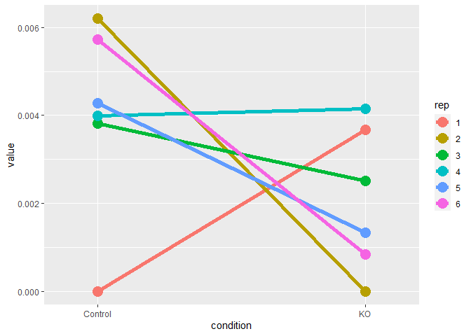<!-- -->
</div>
<div class = "col-md-6">
<br>
<br>  

#### Test performed: linear_paired_t_test  

#### p-value (uncorrected)    
0.247
<br>

Paired t-test performed on linear data. 
 The ratio of standard deviations between the conditions was small enough that the data did not need to be log transformed. 
 The samples were paired.

</div>
</div>


### PC 32:0


<div class = "row">
<div class = "col-md-6">
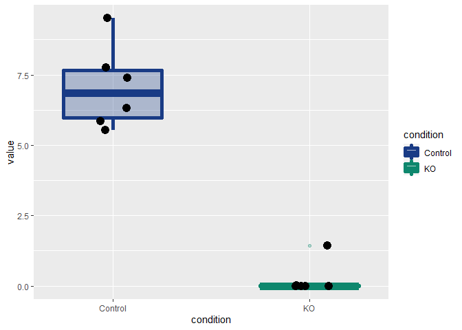<!-- -->
</div>
<div class = "col-md-6">
<br>
<br>  

#### Test performed: none  

#### p-value (uncorrected)    
NA
<br>

The data did not meet the criteria for performing a statistical test. There may have been too few non-zero values or the variance of a condition may have been too high.

</div>
</div>


### PC 32:1


<div class = "row">
<div class = "col-md-6">
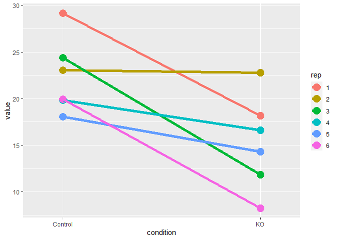<!-- -->
</div>
<div class = "col-md-6">
<br>
<br>  

#### Test performed: linear_paired_t_test  

#### p-value (uncorrected)    
0.0217
<br>

Paired t-test performed on linear data. 
 The ratio of standard deviations between the conditions was small enough that the data did not need to be log transformed. 
 The samples were paired.

</div>
</div>


### PC 32:2


<div class = "row">
<div class = "col-md-6">
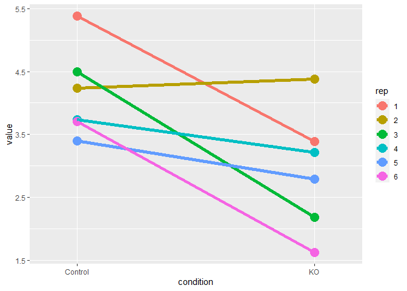<!-- -->
</div>
<div class = "col-md-6">
<br>
<br>  

#### Test performed: linear_paired_t_test  

#### p-value (uncorrected)    
0.033
<br>

Paired t-test performed on linear data. 
 The ratio of standard deviations between the conditions was small enough that the data did not need to be log transformed. 
 The samples were paired.

</div>
</div>


### PC 32:3


<div class = "row">
<div class = "col-md-6">
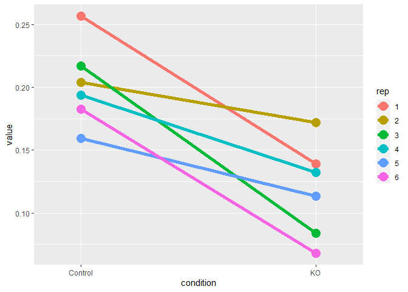<!-- -->
</div>
<div class = "col-md-6">
<br>
<br>  

#### Test performed: linear_paired_t_test  

#### p-value (uncorrected)    
0.00477
<br>

Paired t-test performed on linear data. 
 The ratio of standard deviations between the conditions was small enough that the data did not need to be log transformed. 
 The samples were paired.

</div>
</div>


### PC 32:4


<div class = "row">
<div class = "col-md-6">
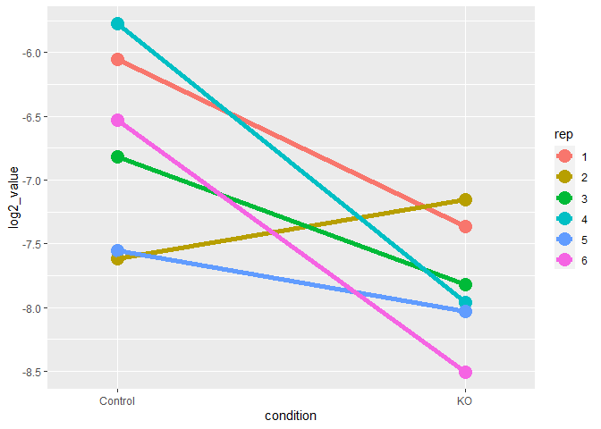<!-- -->
</div>
<div class = "col-md-6">
<br>
<br>  

#### Test performed: log2_paired_t_test  

#### p-value (uncorrected)    
0.0429
<br>

Paired t-test performed on log2 transformed data. The ratio of standard deviations between the conditions exceeded a threshold and so the data was log2 transformed. The samples were paired.

</div>
</div>


### PC 34:1


<div class = "row">
<div class = "col-md-6">
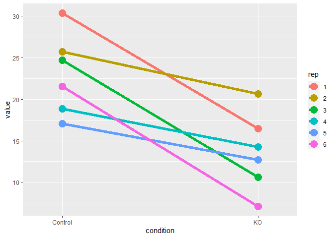<!-- -->
</div>
<div class = "col-md-6">
<br>
<br>  

#### Test performed: linear_paired_t_test  

#### p-value (uncorrected)    
0.00671
<br>

Paired t-test performed on linear data. 
 The ratio of standard deviations between the conditions was small enough that the data did not need to be log transformed. 
 The samples were paired.

</div>
</div>


### PC 34:2


<div class = "row">
<div class = "col-md-6">
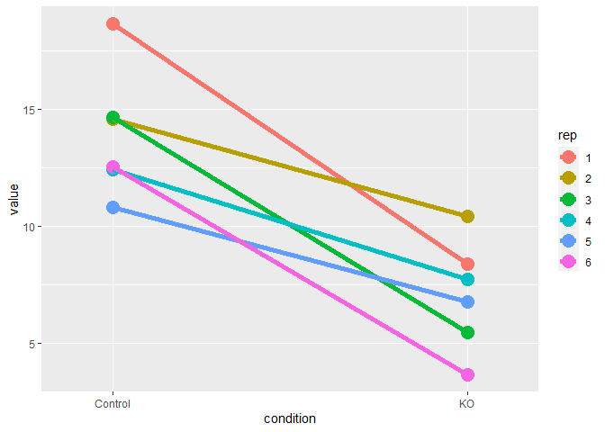<!-- -->
</div>
<div class = "col-md-6">
<br>
<br>  

#### Test performed: linear_paired_t_test  

#### p-value (uncorrected)    
0.00202
<br>

Paired t-test performed on linear data. 
 The ratio of standard deviations between the conditions was small enough that the data did not need to be log transformed. 
 The samples were paired.

</div>
</div>


### PC 34:3


<div class = "row">
<div class = "col-md-6">
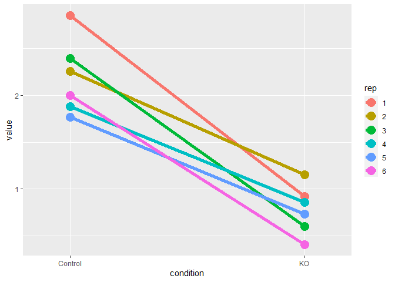<!-- -->
</div>
<div class = "col-md-6">
<br>
<br>  

#### Test performed: linear_paired_t_test  

#### p-value (uncorrected)    
0.000375
<br>

Paired t-test performed on linear data. 
 The ratio of standard deviations between the conditions was small enough that the data did not need to be log transformed. 
 The samples were paired.

</div>
</div>


### PC 34:4


<div class = "row">
<div class = "col-md-6">
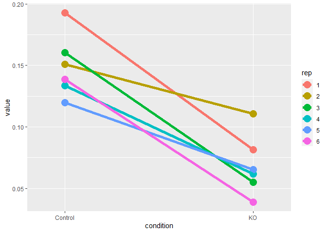<!-- -->
</div>
<div class = "col-md-6">
<br>
<br>  

#### Test performed: linear_paired_t_test  

#### p-value (uncorrected)    
0.0011
<br>

Paired t-test performed on linear data. 
 The ratio of standard deviations between the conditions was small enough that the data did not need to be log transformed. 
 The samples were paired.

</div>
</div>


### PC 34:5


<div class = "row">
<div class = "col-md-6">
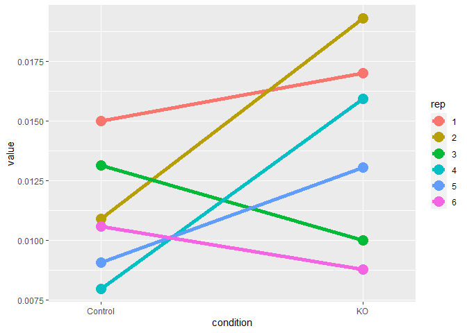<!-- -->
</div>
<div class = "col-md-6">
<br>
<br>  

#### Test performed: linear_paired_t_test  

#### p-value (uncorrected)    
0.2
<br>

Paired t-test performed on linear data. 
 The ratio of standard deviations between the conditions was small enough that the data did not need to be log transformed. 
 The samples were paired.

</div>
</div>


### PC 36:1


<div class = "row">
<div class = "col-md-6">
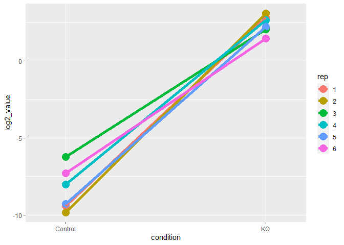<!-- -->
</div>
<div class = "col-md-6">
<br>
<br>  

#### Test performed: log2_paired_t_test  

#### p-value (uncorrected)    
3.25e-05
<br>

Paired t-test performed on log2 transformed data. The ratio of standard deviations between the conditions exceeded a threshold and so the data was log2 transformed. The samples were paired.

</div>
</div>


### PC 36:2


<div class = "row">
<div class = "col-md-6">
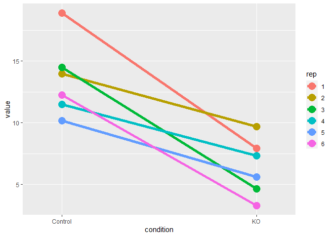<!-- -->
</div>
<div class = "col-md-6">
<br>
<br>  

#### Test performed: linear_paired_t_test  

#### p-value (uncorrected)    
0.00253
<br>

Paired t-test performed on linear data. 
 The ratio of standard deviations between the conditions was small enough that the data did not need to be log transformed. 
 The samples were paired.

</div>
</div>


### PC 36:3


<div class = "row">
<div class = "col-md-6">
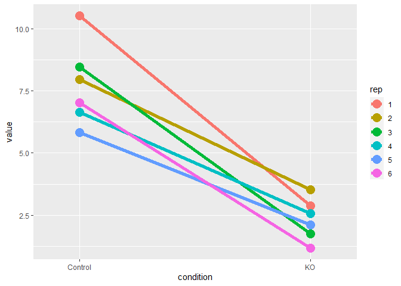<!-- -->
</div>
<div class = "col-md-6">
<br>
<br>  

#### Test performed: linear_paired_t_test  

#### p-value (uncorrected)    
0.000399
<br>

Paired t-test performed on linear data. 
 The ratio of standard deviations between the conditions was small enough that the data did not need to be log transformed. 
 The samples were paired.

</div>
</div>


### PC 36:4


<div class = "row">
<div class = "col-md-6">
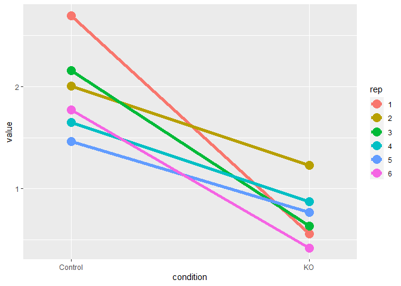<!-- -->
</div>
<div class = "col-md-6">
<br>
<br>  

#### Test performed: linear_paired_t_test  

#### p-value (uncorrected)    
0.00346
<br>

Paired t-test performed on linear data. 
 The ratio of standard deviations between the conditions was small enough that the data did not need to be log transformed. 
 The samples were paired.

</div>
</div>


### PC 36:5


<div class = "row">
<div class = "col-md-6">
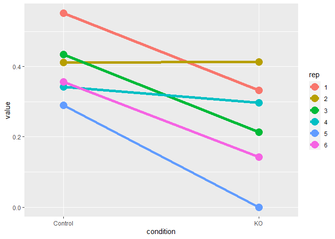<!-- -->
</div>
<div class = "col-md-6">
<br>
<br>  

#### Test performed: linear_paired_t_test  

#### p-value (uncorrected)    
0.0171
<br>

Paired t-test performed on linear data. 
 The ratio of standard deviations between the conditions was small enough that the data did not need to be log transformed. 
 The samples were paired.

</div>
</div>


### PC 36:6


<div class = "row">
<div class = "col-md-6">
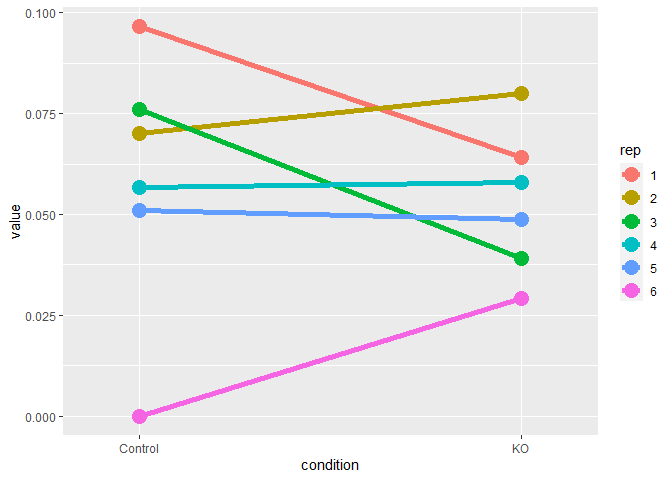<!-- -->
</div>
<div class = "col-md-6">
<br>
<br>  

#### Test performed: linear_paired_t_test  

#### p-value (uncorrected)    
0.632
<br>

Paired t-test performed on linear data. 
 The ratio of standard deviations between the conditions was small enough that the data did not need to be log transformed. 
 The samples were paired.

</div>
</div>


### PC 38:1


<div class = "row">
<div class = "col-md-6">
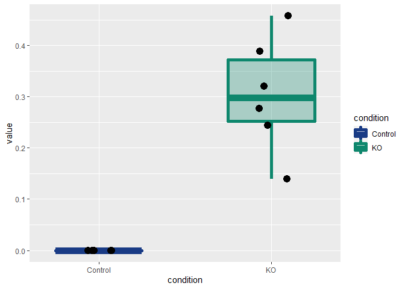<!-- -->
</div>
<div class = "col-md-6">
<br>
<br>  

#### Test performed: none  

#### p-value (uncorrected)    
NA
<br>

The data did not meet the criteria for performing a statistical test. There may have been too few non-zero values or the variance of a condition may have been too high.

</div>
</div>


### PC 38:2


<div class = "row">
<div class = "col-md-6">
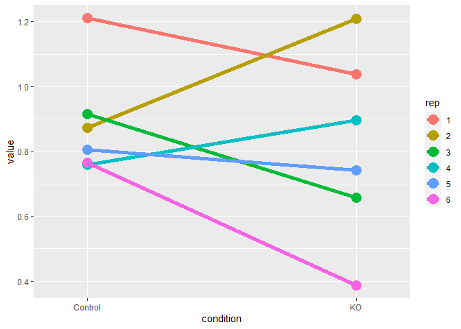<!-- -->
</div>
<div class = "col-md-6">
<br>
<br>  

#### Test performed: linear_paired_t_test  

#### p-value (uncorrected)    
0.563
<br>

Paired t-test performed on linear data. 
 The ratio of standard deviations between the conditions was small enough that the data did not need to be log transformed. 
 The samples were paired.

</div>
</div>


### PC 38:3


<div class = "row">
<div class = "col-md-6">
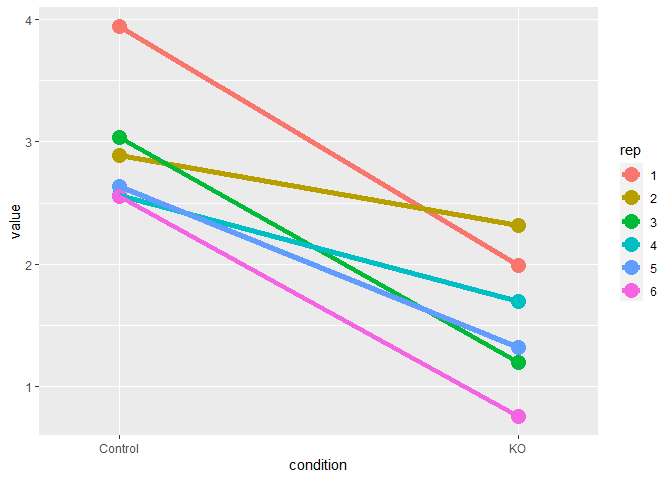<!-- -->
</div>
<div class = "col-md-6">
<br>
<br>  

#### Test performed: linear_paired_t_test  

#### p-value (uncorrected)    
0.00191
<br>

Paired t-test performed on linear data. 
 The ratio of standard deviations between the conditions was small enough that the data did not need to be log transformed. 
 The samples were paired.

</div>
</div>


### PC 38:4


<div class = "row">
<div class = "col-md-6">
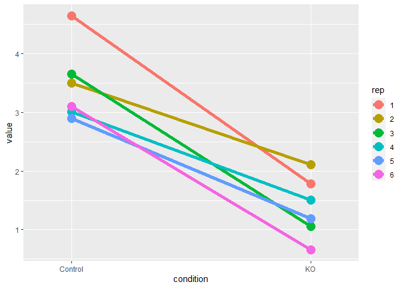<!-- -->
</div>
<div class = "col-md-6">
<br>
<br>  

#### Test performed: linear_paired_t_test  

#### p-value (uncorrected)    
0.000445
<br>

Paired t-test performed on linear data. 
 The ratio of standard deviations between the conditions was small enough that the data did not need to be log transformed. 
 The samples were paired.

</div>
</div>


### PC 38:5


<div class = "row">
<div class = "col-md-6">
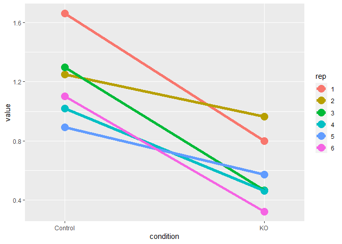<!-- -->
</div>
<div class = "col-md-6">
<br>
<br>  

#### Test performed: linear_paired_t_test  

#### p-value (uncorrected)    
0.00224
<br>

Paired t-test performed on linear data. 
 The ratio of standard deviations between the conditions was small enough that the data did not need to be log transformed. 
 The samples were paired.

</div>
</div>


### PC 38:6


<div class = "row">
<div class = "col-md-6">
<!-- -->
</div>
<div class = "col-md-6">
<br>
<br>  

#### Test performed: linear_paired_t_test  

#### p-value (uncorrected)    
0.00865
<br>

Paired t-test performed on linear data. 
 The ratio of standard deviations between the conditions was small enough that the data did not need to be log transformed. 
 The samples were paired.

</div>
</div>


### PC 38:7


<div class = "row">
<div class = "col-md-6">
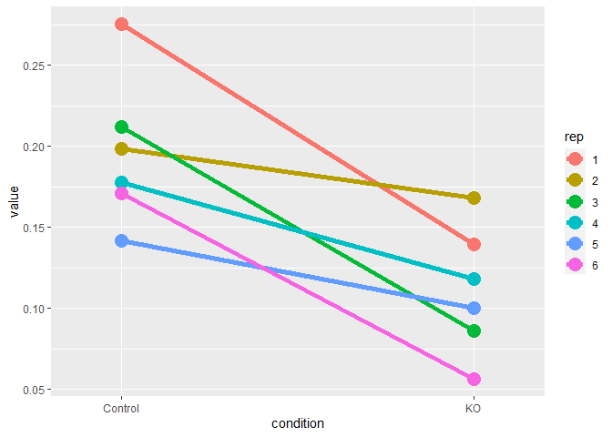<!-- -->
</div>
<div class = "col-md-6">
<br>
<br>  

#### Test performed: linear_paired_t_test  

#### p-value (uncorrected)    
0.00637
<br>

Paired t-test performed on linear data. 
 The ratio of standard deviations between the conditions was small enough that the data did not need to be log transformed. 
 The samples were paired.

</div>
</div>


### PC 40:2


<div class = "row">
<div class = "col-md-6">
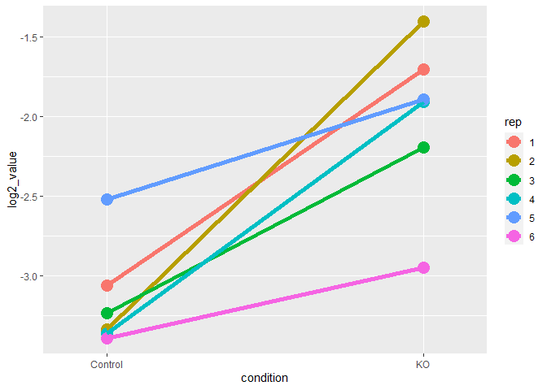<!-- -->
</div>
<div class = "col-md-6">
<br>
<br>  

#### Test performed: log2_paired_t_test  

#### p-value (uncorrected)    
0.0039
<br>

Paired t-test performed on log2 transformed data. The ratio of standard deviations between the conditions exceeded a threshold and so the data was log2 transformed. The samples were paired.

</div>
</div>


### PC 40:3


<div class = "row">
<div class = "col-md-6">
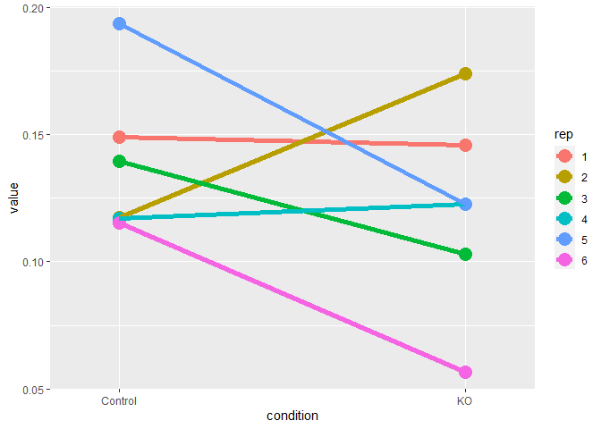<!-- -->
</div>
<div class = "col-md-6">
<br>
<br>  

#### Test performed: linear_paired_t_test  

#### p-value (uncorrected)    
0.398
<br>

Paired t-test performed on linear data. 
 The ratio of standard deviations between the conditions was small enough that the data did not need to be log transformed. 
 The samples were paired.

</div>
</div>


### PC 40:4


<div class = "row">
<div class = "col-md-6">
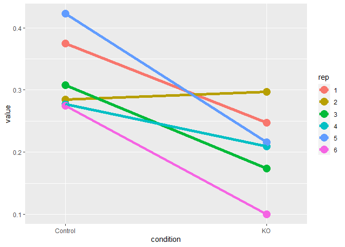<!-- -->
</div>
<div class = "col-md-6">
<br>
<br>  

#### Test performed: linear_paired_t_test  

#### p-value (uncorrected)    
0.0152
<br>

Paired t-test performed on linear data. 
 The ratio of standard deviations between the conditions was small enough that the data did not need to be log transformed. 
 The samples were paired.

</div>
</div>


### PC 40:5


<div class = "row">
<div class = "col-md-6">
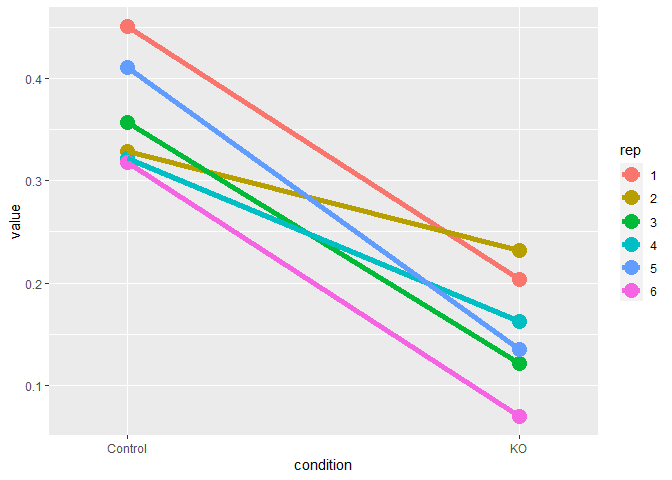<!-- -->
</div>
<div class = "col-md-6">
<br>
<br>  

#### Test performed: linear_paired_t_test  

#### p-value (uncorrected)    
0.000622
<br>

Paired t-test performed on linear data. 
 The ratio of standard deviations between the conditions was small enough that the data did not need to be log transformed. 
 The samples were paired.

</div>
</div>


### PC 40:6


<div class = "row">
<div class = "col-md-6">
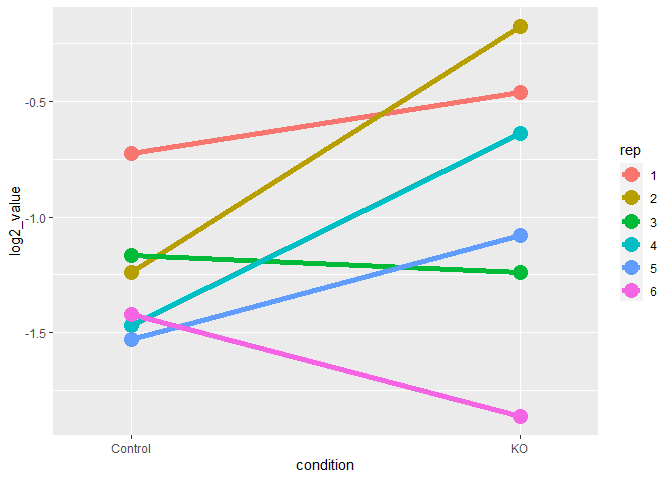<!-- -->
</div>
<div class = "col-md-6">
<br>
<br>  

#### Test performed: log2_paired_t_test  

#### p-value (uncorrected)    
0.186
<br>

Paired t-test performed on log2 transformed data. The ratio of standard deviations between the conditions exceeded a threshold and so the data was log2 transformed. The samples were paired.

</div>
</div>


### PC 40:7


<div class = "row">
<div class = "col-md-6">
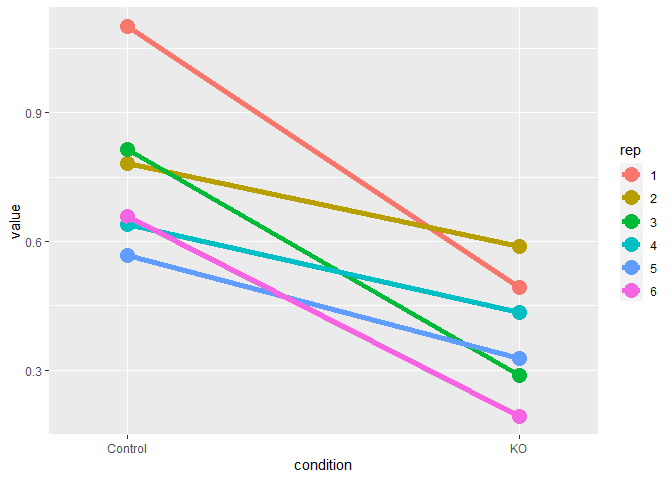<!-- -->
</div>
<div class = "col-md-6">
<br>
<br>  

#### Test performed: linear_paired_t_test  

#### p-value (uncorrected)    
0.004
<br>

Paired t-test performed on linear data. 
 The ratio of standard deviations between the conditions was small enough that the data did not need to be log transformed. 
 The samples were paired.

</div>
</div>


### PC 42:4


<div class = "row">
<div class = "col-md-6">
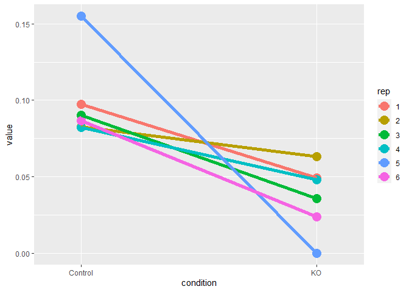<!-- -->
</div>
<div class = "col-md-6">
<br>
<br>  

#### Test performed: linear_paired_t_test  

#### p-value (uncorrected)    
0.0242
<br>

Paired t-test performed on linear data. 
 The ratio of standard deviations between the conditions was small enough that the data did not need to be log transformed. 
 The samples were paired.

</div>
</div>


### PC 42:5


<div class = "row">
<div class = "col-md-6">
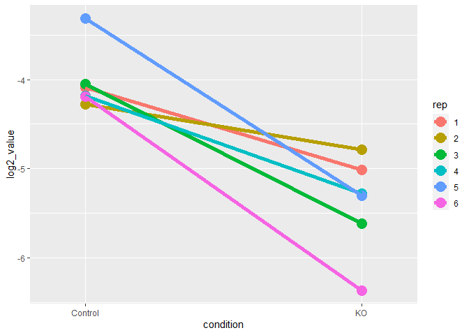<!-- -->
</div>
<div class = "col-md-6">
<br>
<br>  

#### Test performed: log2_paired_t_test  

#### p-value (uncorrected)    
0.00342
<br>

Paired t-test performed on log2 transformed data. The ratio of standard deviations between the conditions exceeded a threshold and so the data was log2 transformed. The samples were paired.

</div>
</div>


### PC 42:6


<div class = "row">
<div class = "col-md-6">
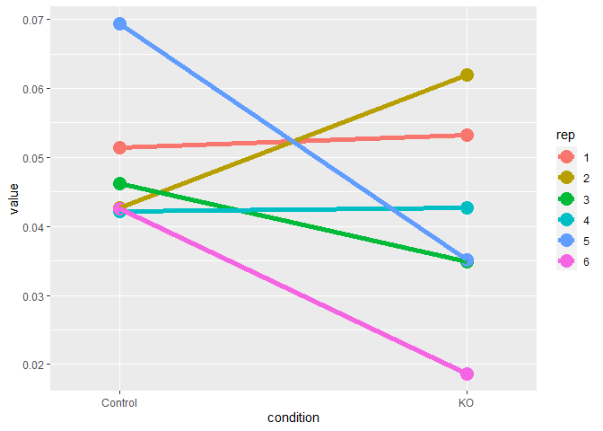<!-- -->
</div>
<div class = "col-md-6">
<br>
<br>  

#### Test performed: linear_paired_t_test  

#### p-value (uncorrected)    
0.359
<br>

Paired t-test performed on linear data. 
 The ratio of standard deviations between the conditions was small enough that the data did not need to be log transformed. 
 The samples were paired.

</div>
</div>


### PC 42:7


<div class = "row">
<div class = "col-md-6">
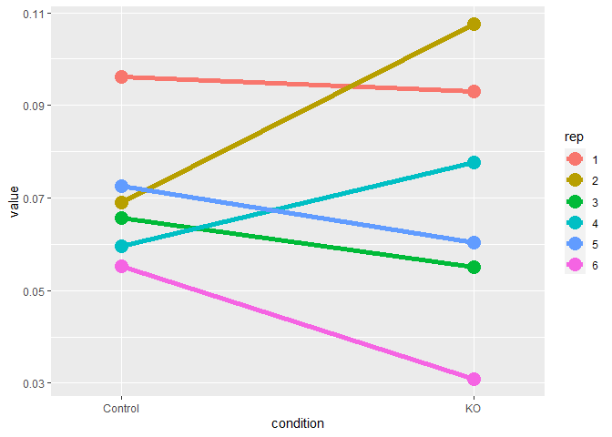<!-- -->
</div>
<div class = "col-md-6">
<br>
<br>  

#### Test performed: linear_paired_t_test  

#### p-value (uncorrected)    
0.914
<br>

Paired t-test performed on linear data. 
 The ratio of standard deviations between the conditions was small enough that the data did not need to be log transformed. 
 The samples were paired.

</div>
</div>


### SM 12:0


<div class = "row">
<div class = "col-md-6">
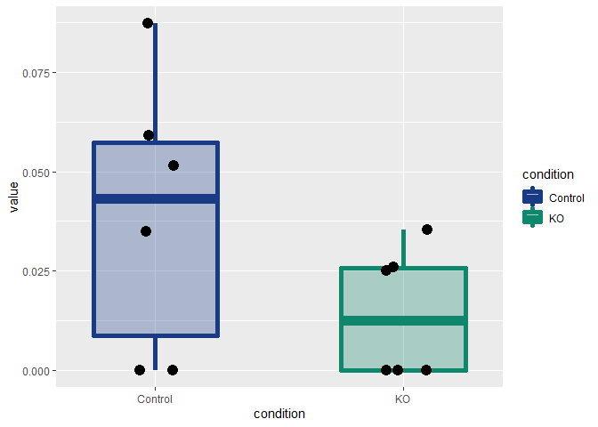<!-- -->
</div>
<div class = "col-md-6">
<br>
<br>  

#### Test performed: none  

#### p-value (uncorrected)    
NA
<br>

The data did not meet the criteria for performing a statistical test. There may have been too few non-zero values or the variance of a condition may have been too high.

</div>
</div>


### SM 14:0


<div class = "row">
<div class = "col-md-6">
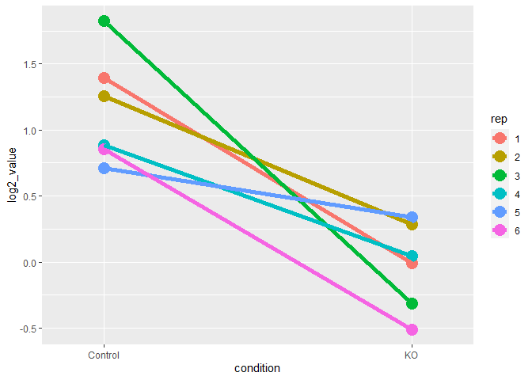<!-- -->
</div>
<div class = "col-md-6">
<br>
<br>  

#### Test performed: log2_paired_t_test  

#### p-value (uncorrected)    
0.00492
<br>

Paired t-test performed on log2 transformed data. The ratio of standard deviations between the conditions exceeded a threshold and so the data was log2 transformed. The samples were paired.

</div>
</div>


### SM 14:1


<div class = "row">
<div class = "col-md-6">
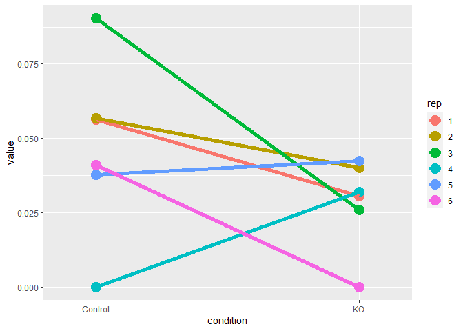<!-- -->
</div>
<div class = "col-md-6">
<br>
<br>  

#### Test performed: linear_paired_t_test  

#### p-value (uncorrected)    
0.238
<br>

Paired t-test performed on linear data. 
 The ratio of standard deviations between the conditions was small enough that the data did not need to be log transformed. 
 The samples were paired.

</div>
</div>


### SM 16:0


<div class = "row">
<div class = "col-md-6">
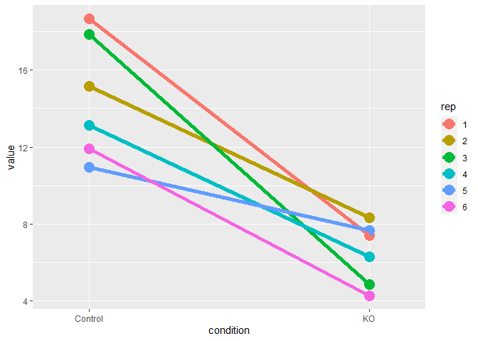<!-- -->
</div>
<div class = "col-md-6">
<br>
<br>  

#### Test performed: linear_paired_t_test  

#### p-value (uncorrected)    
0.00223
<br>

Paired t-test performed on linear data. 
 The ratio of standard deviations between the conditions was small enough that the data did not need to be log transformed. 
 The samples were paired.

</div>
</div>


### SM 16:1


<div class = "row">
<div class = "col-md-6">
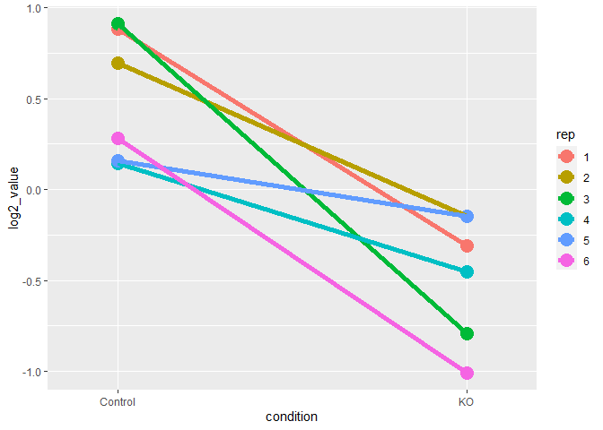<!-- -->
</div>
<div class = "col-md-6">
<br>
<br>  

#### Test performed: log2_paired_t_test  

#### p-value (uncorrected)    
0.00503
<br>

Paired t-test performed on log2 transformed data. The ratio of standard deviations between the conditions exceeded a threshold and so the data was log2 transformed. The samples were paired.

</div>
</div>


### SM 16:2


<div class = "row">
<div class = "col-md-6">
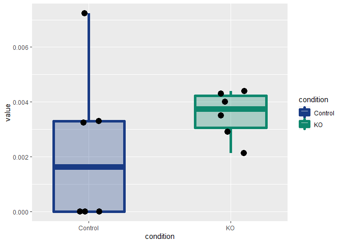<!-- -->
</div>
<div class = "col-md-6">
<br>
<br>  

#### Test performed: none  

#### p-value (uncorrected)    
NA
<br>

The data did not meet the criteria for performing a statistical test. There may have been too few non-zero values or the variance of a condition may have been too high.

</div>
</div>


### SM 18:0


<div class = "row">
<div class = "col-md-6">
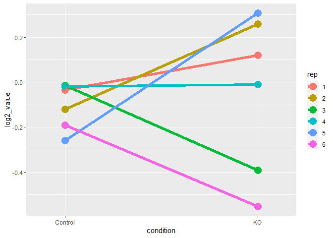<!-- -->
</div>
<div class = "col-md-6">
<br>
<br>  

#### Test performed: log2_paired_t_test  

#### p-value (uncorrected)    
0.71
<br>

Paired t-test performed on log2 transformed data. The ratio of standard deviations between the conditions exceeded a threshold and so the data was log2 transformed. The samples were paired.

</div>
</div>


### SM 18:1


<div class = "row">
<div class = "col-md-6">
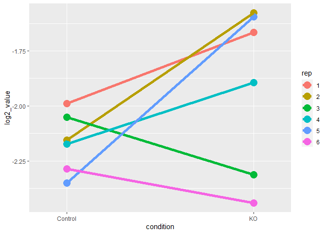<!-- -->
</div>
<div class = "col-md-6">
<br>
<br>  

#### Test performed: log2_paired_t_test  

#### p-value (uncorrected)    
0.18
<br>

Paired t-test performed on log2 transformed data. The ratio of standard deviations between the conditions exceeded a threshold and so the data was log2 transformed. The samples were paired.

</div>
</div>


### SM 18:2


<div class = "row">
<div class = "col-md-6">
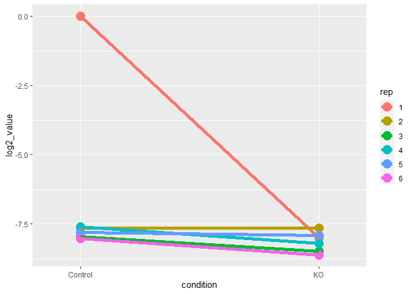<!-- -->
</div>
<div class = "col-md-6">
<br>
<br>  

#### Test performed: log2_paired_t_test  

#### p-value (uncorrected)    
0.254
<br>

Paired t-test performed on log2 transformed data. The ratio of standard deviations between the conditions exceeded a threshold and so the data was log2 transformed. The samples were paired.

</div>
</div>


### SM 20:0


<div class = "row">
<div class = "col-md-6">
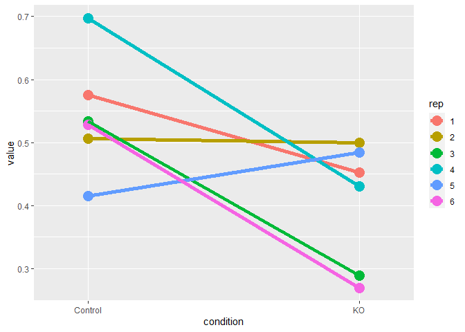<!-- -->
</div>
<div class = "col-md-6">
<br>
<br>  

#### Test performed: linear_paired_t_test  

#### p-value (uncorrected)    
0.0647
<br>

Paired t-test performed on linear data. 
 The ratio of standard deviations between the conditions was small enough that the data did not need to be log transformed. 
 The samples were paired.

</div>
</div>


### SM 20:1


<div class = "row">
<div class = "col-md-6">
<!-- -->
</div>
<div class = "col-md-6">
<br>
<br>  

#### Test performed: linear_paired_t_test  

#### p-value (uncorrected)    
0.0103
<br>

Paired t-test performed on linear data. 
 The ratio of standard deviations between the conditions was small enough that the data did not need to be log transformed. 
 The samples were paired.

</div>
</div>


### SM 20:2


<div class = "row">
<div class = "col-md-6">
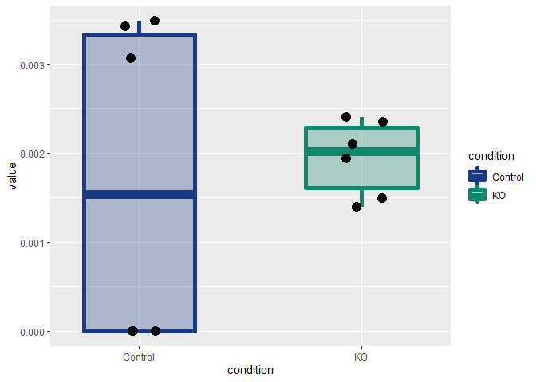<!-- -->
</div>
<div class = "col-md-6">
<br>
<br>  

#### Test performed: none  

#### p-value (uncorrected)    
NA
<br>

The data did not meet the criteria for performing a statistical test. There may have been too few non-zero values or the variance of a condition may have been too high.

</div>
</div>


### SM 22:0


<div class = "row">
<div class = "col-md-6">
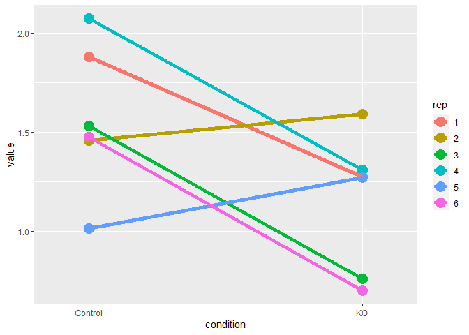<!-- -->
</div>
<div class = "col-md-6">
<br>
<br>  

#### Test performed: linear_paired_t_test  

#### p-value (uncorrected)    
0.0861
<br>

Paired t-test performed on linear data. 
 The ratio of standard deviations between the conditions was small enough that the data did not need to be log transformed. 
 The samples were paired.

</div>
</div>


### SM 22:1


<div class = "row">
<div class = "col-md-6">
<!-- -->
</div>
<div class = "col-md-6">
<br>
<br>  

#### Test performed: log2_paired_t_test  

#### p-value (uncorrected)    
0.000513
<br>

Paired t-test performed on log2 transformed data. The ratio of standard deviations between the conditions exceeded a threshold and so the data was log2 transformed. The samples were paired.

</div>
</div>


### SM 22:2


<div class = "row">
<div class = "col-md-6">
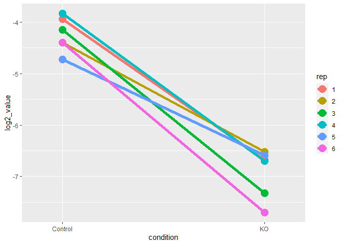<!-- -->
</div>
<div class = "col-md-6">
<br>
<br>  

#### Test performed: log2_paired_t_test  

#### p-value (uncorrected)    
8.9e-05
<br>

Paired t-test performed on log2 transformed data. The ratio of standard deviations between the conditions exceeded a threshold and so the data was log2 transformed. The samples were paired.

</div>
</div>


### SM 24:1


<div class = "row">
<div class = "col-md-6">
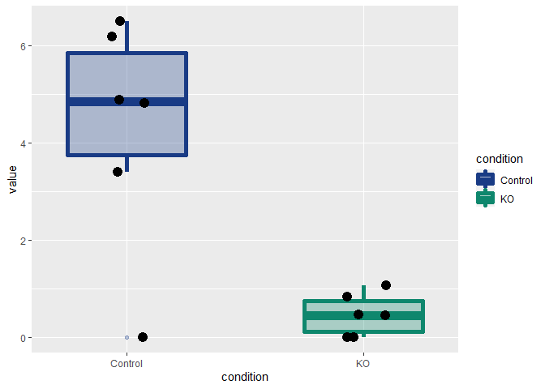<!-- -->
</div>
<div class = "col-md-6">
<br>
<br>  

#### Test performed: none  

#### p-value (uncorrected)    
NA
<br>

The data did not meet the criteria for performing a statistical test. There may have been too few non-zero values or the variance of a condition may have been too high.

</div>
</div>


### SM 24:2


<div class = "row">
<div class = "col-md-6">
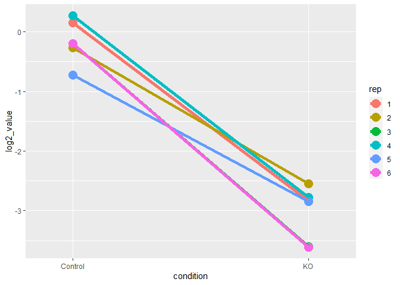<!-- -->
</div>
<div class = "col-md-6">
<br>
<br>  

#### Test performed: log2_paired_t_test  

#### p-value (uncorrected)    
5.41e-05
<br>

Paired t-test performed on log2 transformed data. The ratio of standard deviations between the conditions exceeded a threshold and so the data was log2 transformed. The samples were paired.

</div>
</div>


### SM 24:3


<div class = "row">
<div class = "col-md-6">
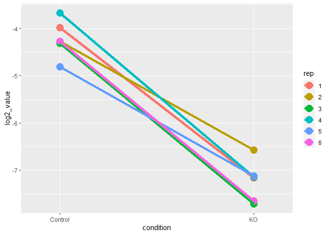<!-- -->
</div>
<div class = "col-md-6">
<br>
<br>  

#### Test performed: log2_paired_t_test  

#### p-value (uncorrected)    
4.28e-05
<br>

Paired t-test performed on log2 transformed data. The ratio of standard deviations between the conditions exceeded a threshold and so the data was log2 transformed. The samples were paired.

</div>
</div>


### SM 24:4


<div class = "row">
<div class = "col-md-6">
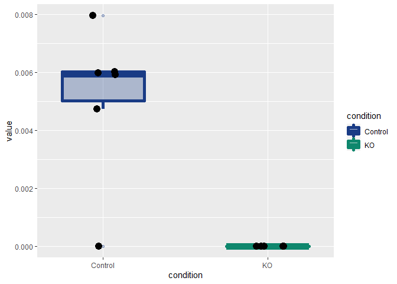<!-- -->
</div>
<div class = "col-md-6">
<br>
<br>  

#### Test performed: none  

#### p-value (uncorrected)    
NA
<br>

The data did not meet the criteria for performing a statistical test. There may have been too few non-zero values or the variance of a condition may have been too high.

</div>
</div>


## Heatmap


### Heatmap ordered by lipid subclass

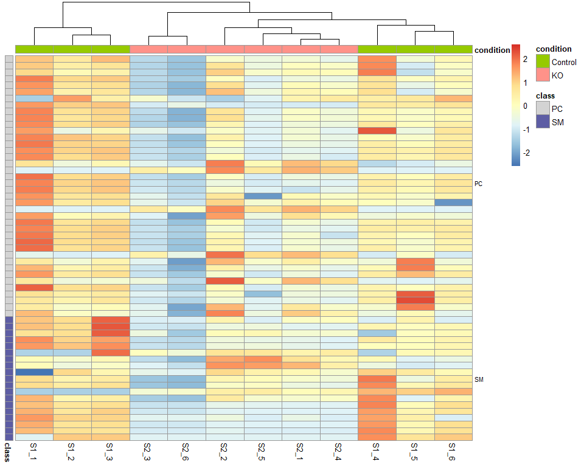<!-- -->

<br>
<br>

### With row clustering

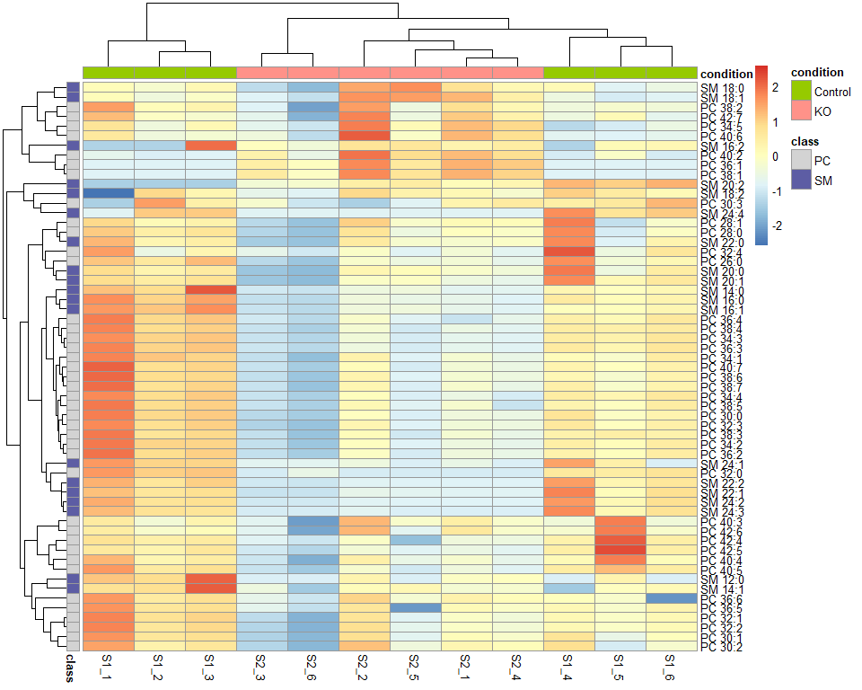<!-- -->


## Test


### PC test plot


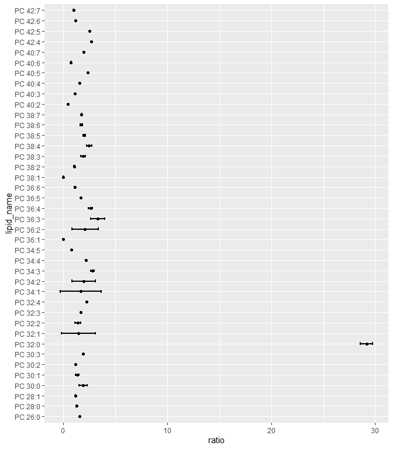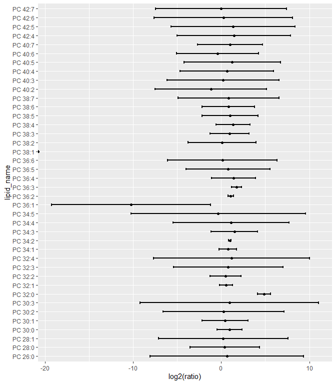

### SM test plot


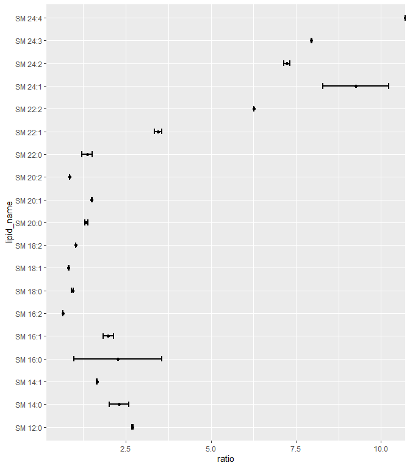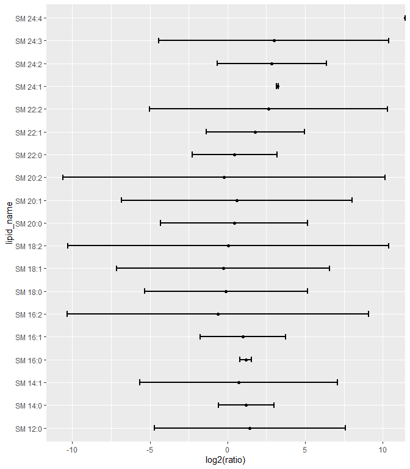


